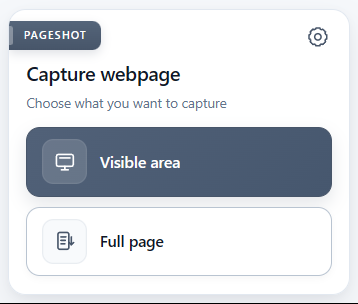
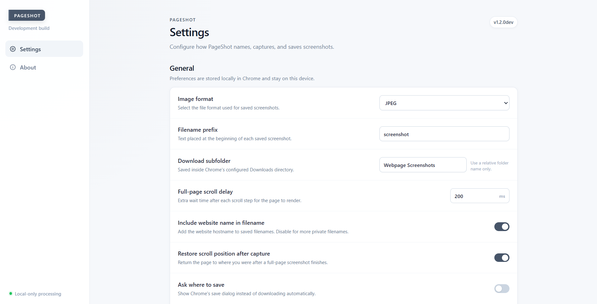

# PageShot

PageShot is a lightweight Chrome extension for capturing either the visible part of a webpage or the entire page and saving it locally as an image.

## Why PageShot?

Capturing webpages with the built-in screenshot tools on Windows or macOS can become tedious, especially when you need the entire page rather than only what is visible on screen. Full-page captures often mean taking multiple screenshots and manually stitching them together.

Browser extensions exist for this, but many can be inconsistent on longer or more complex pages, or include more functionality than needed for a simple capture workflow.

PageShot was built as a small, local-first alternative: open the extension, choose what you want to capture, and save the result.

## Preview

  

<em>Quickly capture the visible area or the entire webpage.</em>

### Settings

  

## Features

- Capture the visible browser area.
- Capture and stitch an entire scrollable webpage.
- Save as PNG, JPEG, or WebP.
- PNG is the default format.
- Custom filename prefix and Downloads subfolder.
- Optionally include the website name in the filename.
- Optionally restore the original scroll position after a full-page capture.
- Optional **Ask where to save** behavior.
- Local-only processing with no analytics, uploads, or remote dependencies.

## Install

PageShot is currently distributed as a development build and can be loaded directly from the repository.

1. Download or clone this repository.
2. Open Chrome and go to `chrome://extensions`.
3. Enable **Developer mode**.
4. Click **Load unpacked**.
5. Select the PageShot repository folder containing `manifest.json`.
6. Pin PageShot from the Chrome extensions menu for quick access.

The same process works with Chrome on Windows, macOS, and Linux.

## Use

Open a webpage and click the PageShot icon.

- **Visible area** saves what is currently visible in the browser window.
- **Full page** scrolls through the page, captures each section, stitches them together, and saves one image locally.

Use the gear icon to configure the image format, filename, download folder, scroll behavior, and other preferences.

## Privacy

PageShot is designed to work locally.

- Screenshots are not uploaded to a server.
- No analytics or telemetry is included.
- No advertising or tracking SDKs are used.
- No remote scripts, fonts, or CDN dependencies are loaded.
- Preferences are stored locally using Chrome's extension storage.

Full-page capture physically scrolls the webpage, so the website itself may react to normal scroll events or lazy-load content during capture.

## Limitations

Full-page capture uses a scroll-and-stitch approach. Very large pages, infinite-scroll websites, complex nested layouts, or unusual sticky elements may not always capture perfectly.

Chrome also prevents extensions from capturing certain browser-managed pages such as `chrome://` URLs.

## Development status

PageShot is currently a development version. The core capture workflow is functional, but the project is still being refined and tested across different websites and Chromium-based browsers.

Feedback and contributions are welcome.

## License

MIT — see [LICENSE](LICENSE).
